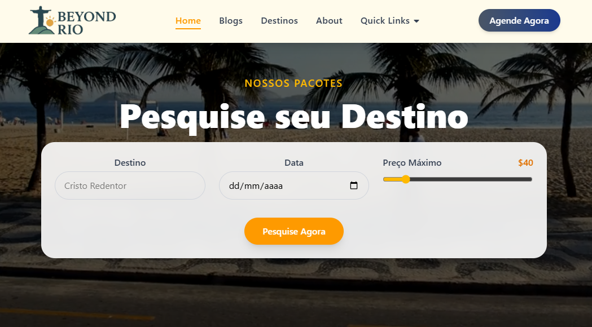
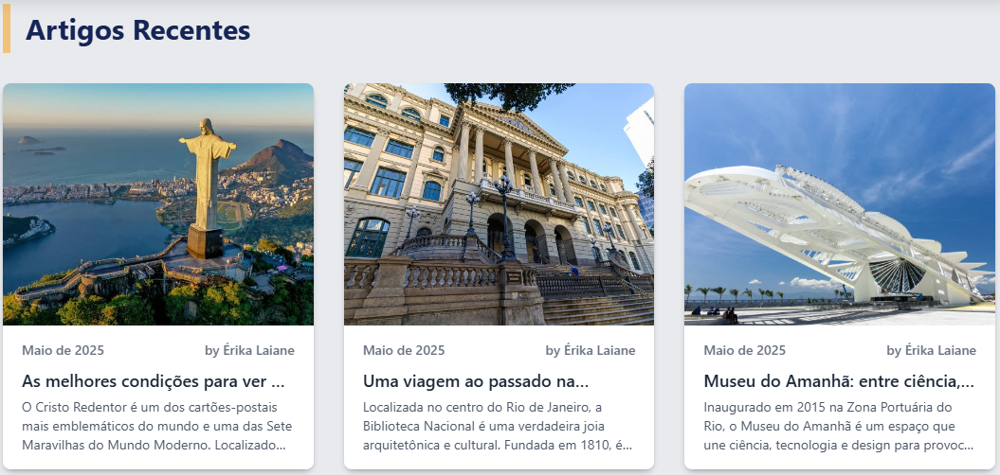

# 🌴 Beyond Rio

**Beyond Rio** é um site de uma agência de turismo fictícia focada na cidade maravilhosa: o Rio de Janeiro!  
O projeto tem como objetivo apresentar os principais pontos turísticos da cidade, com uma navegação fluida, moderna e acessível, utilizando as tecnologias mais atuais da web.

Na seção principal (hero), os visitantes podem simular uma viagem escolhendo o **destino desejado**, **data da viagem** e o **valor estimado a ser gasto**, tornando a experiência mais personalizada e interativa.


---

## 🚀 Tecnologias Utilizadas

- [React](https://reactjs.org/) – Biblioteca para criação da interface
- [Vite](https://vitejs.dev/) – Ferramenta de build rápida
- [Tailwind CSS](https://tailwindcss.com/) – Estilização moderna e responsiva
- [React Router DOM](https://reactrouter.com/) – Roteamento entre páginas
- [GitHub Pages](https://pages.github.com/) – Deploy gratuito

---

## 🧭 Funcionalidades

- Página inicial com formulário de simulação de viagem
- Lista de destinos turísticos no Rio de Janeiro
- Seção de blog com curiosidades e dicas de viagem
- Página "Sobre" com informações da agência
- Design responsivo para todos os dispositivos
- Animações suaves com AOS (Animate On Scroll)

---

## 📸 Capturas de Tela





---

## 🔗 Acesse o site

➡️ [https://erikalaiane.github.io/beyond-rio/](https://erikalaiane.github.io/beyond-rio/)

---

## 🛠️ Instalação para Desenvolvedores

```bash
# Clone o repositório
git clone https://github.com/erikalaiane/beyond-rio

# Acesse a pasta do projeto
cd beyond-rio

# Instale as dependências
npm install

# Rode o projeto localmente
npm run dev


✨ Autor
Desenvolvido com carinho por Erika Laiane 💙

🔗 GitHub
🔗 LinkedIn